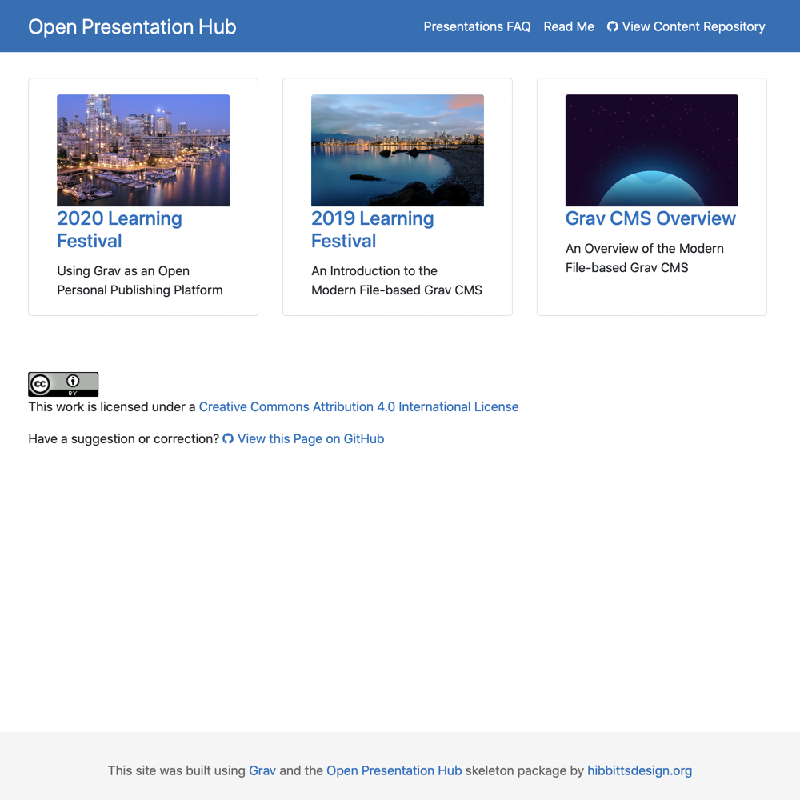

# Grav Open Matter Presentation Hub Skeleton

  

**Grav Open Presentation Hub** with Git Sync is designed to help create and host Markdown-based slides created with Ole Vik's [Presentation Plugin](https://github.com/OleVik/grav-plugin-presentation), which uses the [Reveal.js Presentation Framework](https://revealjs.com/#/). Built with the open source modern file-based [Grav CMS](http://getgrav.org).

Information and Documentation
---
http://learn.hibbittsdesign.org/openpresentationhub

Quick Install Instructions
---
**Pre-flight Checklist**  

1. Confirm Web server PHP version (PHP 7.1 or higher)
2. Web server login credentials (username and password)

**Installation Steps**  

1. Download the ready-to-run [Open Presentation Hub Skeleton Package](http://hibbittsdesign.org/blog/downloads/grav-skeleton-open-matter-presentation-hub-site.zip)
2. Unzip the package onto your desktop  
3. Copy the entire Grav Open Presentation Hub folder to your Web server  
4. Point your browser to the Web server folder  
5. Create your site administrator account when prompted  
6. And you're done! (press the  icon in the Admin Panel to preview site)

Grav Open Presentation Hub Screenshots
---
  
_Figure 1. Example Grav Open Presentation Hub website. Explore an example open matter presentation hub site at [demo.hibbittsdesign.org/grav-open-matter-presentation-hub/](https://demo.hibbittsdesign.org/grav-skeleton-open-matter-presentation-hub-site/)._

  
_Figure 2. Example Presentation for embedding. Explore an example presentation for embedding at [demo.hibbittsdesign.org/grav-skeleton-open-matter-presentation-hub-site/page-with-presentation/chromeless:true](https://demo.hibbittsdesign.org/grav-skeleton-open-matter-presentation-hub-site/page-with-presentation/chromeless:true)._

  
_Figure 3. Example fullscreen Presentation view. Explore an example presentation in fullscreen view at [demo.hibbittsdesign.org/grav-skeleton-open-matter-presentation-hub-site/presentations/placeholder-slides](https://demo.hibbittsdesign.org/grav-skeleton-open-matter-presentation-hub-site/presentations/placeholder-slides)._

  
_Figure 4. Open Presentation Hub pages page._

  
_Figure 5. Example Presentation page with Markdown._
